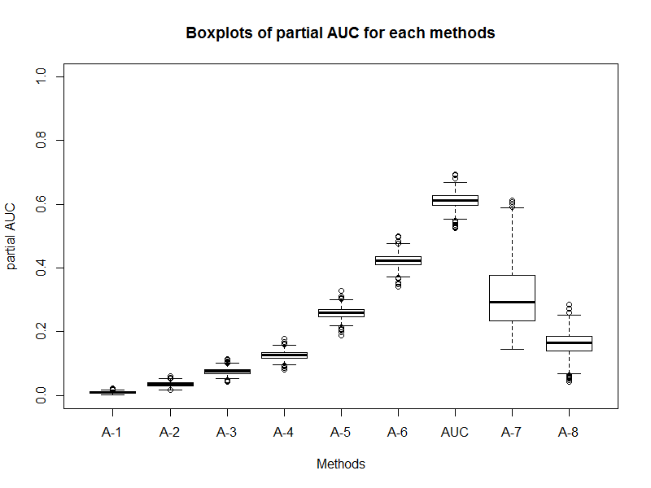

## Description of the data
The source of the data is my master thesis. The goal is to explore how effect of each truncation method on estimating the partial area under the ROC curve (pAUC) under different settings. Each setting can be described with the following parameters.  
1. or - initial value of the odds ratio  
2. hetero - initial value of the heterogeneity  
3. distr - distribution of the values of specificity  
4. rt - ratio of the numbers of cases and non-cases  
1,000 of estimated pAUC are simulated under each method in each setting. The unbiaseness and preciseness of the estimated pAUC is what we concern.  
Here is the table for the baseline setting, which is "a0=ln2, b0=0, Ds=mixed uniform distribution and Rt=50:200".
```{r setup, include=FALSE}
knitr::opts_chunk$set(echo = TRUE)
```

```{r}
library(tidyverse)
library(dplyr)
dat1<-read_csv("hw4-data2.csv")
head(dat1)
```
## Problems
Tables  
1. They are unorganized. They were even messier (as hw4-original data.xls).  
2. There are some notation that only I know, which make it hard to read.  

Plots  
  
1. There are too many plots. For each setting, I was using 10 graphs to illastrute, however, some comparisons are omitted in this assignments.   
2. The plots only showed the comparison among methods, for the effects of cases/non-cases, distribution, odds ratio and heterogeneity, the graphs were on different pages which made it hard to find.  
  
To improve the data visualization, I did the following steps:  
  
##Step One (in excel)  
1. Remove repeated row name and column names  
2. Align the data and unify the format, font and size  
3. Merge all the sheets by adding columns to indicate the setting  
  
##Step Two (in R)  
1. Rearrange the data  
```{r}
dat2 <- (dat1
         %>% rename(p7=auc) # column name was "auc", but I cannot stop the automatic ordering in the following gathering
         %>% gather(key=method,value=val,-c(type,rt,distr,or,hetero,parameter),convert=FALSE) 
         %>% spread(key=parameter,value=val) 
)
head(dat2)
```
2. Since the base setting need to be used in each comparison, I added duplicate rows of the "base", and factorize "or", "rt", "hetero".  
```{r}
dat3<-(dat2
       %>% rbind(dat2
                 %>% filter(type=="base")
                 %>% mutate(type="ratio"))
       %>% rbind(dat2
                 %>% filter(type=="base")
                 %>% mutate(type="odds.ratio"))
       %>% rbind(dat2
                 %>% filter(type=="base")
                 %>% mutate(type="heterogeneity"))
       %>% mutate(type=ifelse(type=="base","distribution",type))
       %>% mutate(rt=factor(rt))
       %>% mutate(or=factor(or))
       %>% mutate(hetero=factor(hetero))
)
head(dat3)
```
3. Plot the data  

```{r}
gg5 <- (ggplot(dat3,aes(method,mean,colour=interaction(rt,distr,or,hetero))) 
        + geom_point()
        + geom_point(aes(method,theoretical),colour="black")
        + geom_ribbon(aes(ymin=mean-se,ymax=mean+se,group=interaction(rt,distr,or,hetero),
                          fill=interaction(rt,distr,or,hetero)), 
                      colour=NA,alpha=0.3)
        + facet_grid(~type)
        + labs(x="method",y="theoretical,mean+/-se")
)
```
At first, I plotted each comparison individually, as hw4-plot1 to hw4-plot4, then I found the above way performs better.

```{r pressure, echo=FALSE}
print(gg5)
```

There are still some problem with the new graphs.  
1.Treating "a0=ln2, b0=0, mixed uniform distribution and ratio=50:200" as the baseline. The plot of baseline appearred four times, which is "a waste of ink". I cannot figure out a way to let the plot of baseline shared by all four comparisons.  
2.Each method is actually corresponding to a numeric value, and they are not in equal interval. I would like to make the distance on x axis consistent to the distance of those numeric values, but I did not figure out how to do it. I only found how to apply different x axis space in each facet.  
3. In the facet "distribution" and "ratio", all the stripes are highly overlapped, which means there is no much difference caused by the distribution and ratio of cases/non-case. This makes the graph look terrible, though this is one conclusion in my thesis.  
4. The bias were so tiny in this dataset (the values in the table were timed by 1000), which are shown by the distance between colour points and black. In my thesis, I plotted the bias seperately. Is there any method to make it more obvious on the graph?  